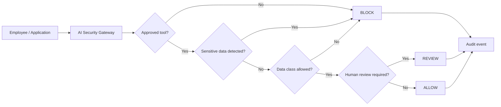

# AI Security Starter Kit

> **Think before you share.** A practical, GitHub-ready reference implementation for safer AI adoption in organizations.

[](https://github.com/YOUR-USERNAME/ai-security-starter-kit/actions/workflows/test.yml)


This repository is the technical companion to the **AI Security — Use AI Smartly** case study. It turns the five company actions from the presentation into a small working implementation that teams can inspect, run, test, and extend.

## The five actions → working artifacts

| Company action | Repository implementation |
|---|---|
| **Provide approved tools** | Policy-as-code in `policies/approved_tools.yaml` |
| **Set simple guidelines** | Human-readable policy in `policies/ai_usage_policy.md` |
| **Offer training & examples** | Safe/unsafe scenarios in `examples/` |
| **Monitor & support** | Metadata-only JSONL audit events (prompt text is not logged) |
| **Learn & improve** | Automated tests, CI workflow, configurable rules |

## What it demonstrates

The demo evaluates a request *before* text is shared with an AI tool. It checks the selected tool, scans for common sensitive patterns, applies data-classification rules, requires human review where configured, returns **ALLOW / REVIEW / BLOCK**, and records a minimal audit event.



## Quick start

Requires **Python 3.10+**.

```bash
python -m venv .venv
source .venv/bin/activate        # Windows: .venv\\Scripts\\activate
pip install -r requirements.txt
python app.py
```

Open `http://127.0.0.1:5000` and try the included scenarios.

### CLI

```bash
python -m src.guardrail --tool company-chat-ai \
  --data-class public \
  --text "Summarize this public announcement"
```

Try a blocked request:

```bash
python -m src.guardrail --tool company-chat-ai \
  --data-class internal \
  --text "password: DontShareThis123"
```

Try a human-review request:

```bash
python -m src.guardrail --tool company-chat-ai \
  --data-class customer \
  --text "Summarize the approved customer briefing"
```

## Example decisions

| Scenario | Expected result | Why |
|---|---|---|
| Public text + approved tool | `ALLOW` | Policy checks pass |
| Password/API key/private key | `BLOCK` | Sensitive pattern detected |
| Unapproved tool | `BLOCK` | Tool is not on the approved list |
| Customer data + company tool | `REVIEW` | Human approval is configured |
| Confidential data + public demo tool | `BLOCK` | Data class is not allowed |

## Repository structure

```text
ai-security-starter-kit/
├── .github/
│   ├── ISSUE_TEMPLATE/
│   └── workflows/test.yml
├── docs/
│   ├── architecture.md
│   ├── implementation-guide.md
│   └── threat-model.md
├── examples/
├── policies/
├── src/
│   └── guardrail.py
├── tests/
├── app.py
├── Dockerfile
├── SECURITY.md
├── CONTRIBUTING.md
└── LICENSE
```

## Design principles

**Share less.** The sample blocks obvious secrets and personal identifiers before AI use. **Least privilege.** Only approved tools and explicitly allowed data classes pass. **Human in the loop.** Sensitive/high-impact scenarios can be routed to review. **Audit without collecting prompts.** The demo logs decision metadata, not the submitted text. **Policy as code.** Teams can review and version-control approved-tool rules.

## Important security note

This is an **educational reference implementation**, not a production DLP, CASB, IAM, or AI gateway. Regex detection is intentionally simple and can produce false positives/negatives. Do not treat an `ALLOW` result as proof that content is safe. Production deployments should integrate enterprise identity, authorization, DLP/classification, secret management, encrypted centralized logging, model/vendor controls, approval workflows, monitoring, and security review.

Never commit real passwords, API keys, customer data, private keys, or confidential company information to this repository.

## Roadmap

Potential extensions include enterprise SSO/RBAC, pluggable DLP scanners, policy engines, approval APIs, SIEM integration, model/vendor risk metadata, rate limits, and automated policy tests.

## License

MIT — see `LICENSE`.
