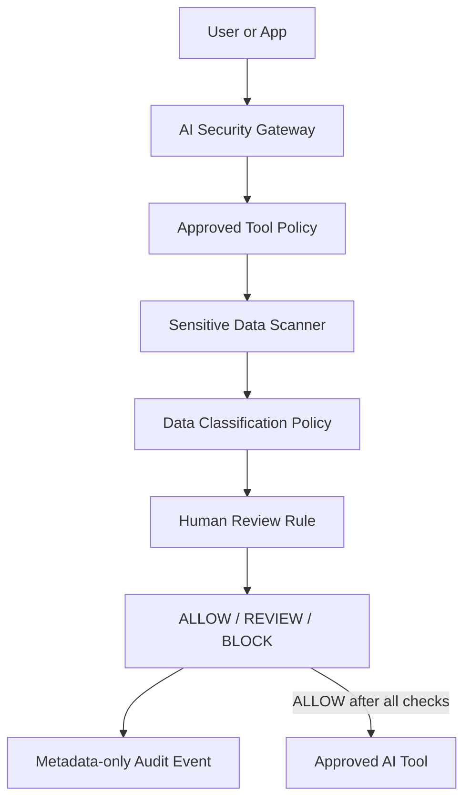

# Architecture

The starter kit places a lightweight policy gate between a user/application and an AI service.

## Trust boundaries

1. **User boundary** — submitted text may contain sensitive data.
2. **Gateway boundary** — policy and scanning execute before external AI access.
3. **AI provider boundary** — only approved content should cross this boundary.
4. **Audit boundary** — the demo stores decision metadata and finding categories, not prompt text.

## Production mapping

The reference components can map to enterprise IAM/SSO, DLP/classification, a policy engine, approval workflow, AI gateway/model proxy, and SIEM/audit platform.
